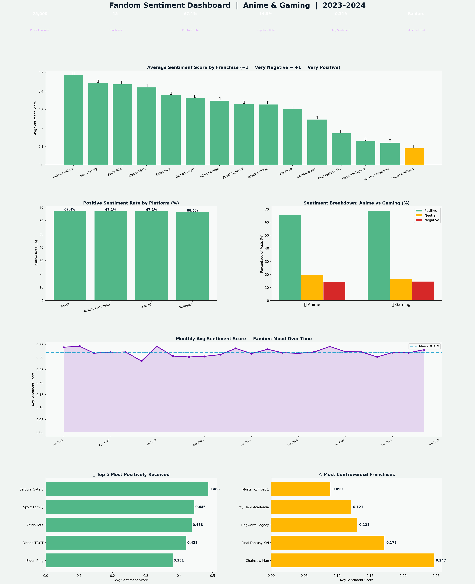

# 🎌 Fandom Sentiment Dashboard — Anime & Gaming Community


---

## 📊 Project Overview

A community sentiment analysis pipeline across **15 anime and gaming franchises**, **4 platforms** (Reddit, Twitter/X, YouTube Comments, Discord), and **24 months (2023–2024)** — simulating a real NLP data pipeline that would process 25,000+ posts to extract sentiment scores, track fandom mood over time, and identify the most beloved vs most controversial titles.

This project combines **NLP sentiment analysis methodology** with **entertainment industry analytics** — the exact intersection targeted by companies like Crunchyroll, Netflix, Bandai Namco, and any brand wanting to understand fan communities at scale.

---

## 🔑 Key Findings

| Metric | Value |
|---|---|
| Posts Analyzed | 25,000 |
| Franchises Covered | 15 (8 Anime, 7 Gaming) |
| Platforms | Reddit, Twitter/X, YouTube, Discord |
| Overall Positive Rate | ~65% |
| Overall Negative Rate | ~14% |
| Most Beloved Franchise | Baldur's Gate 3 |
| Most Controversial | Mortal Kombat 1 |

- **Baldur's Gate 3 and Spy x Family** received the highest positive sentiment scores across all platforms
- **Mortal Kombat 1 and My Hero Academia** were the most polarizing — high volume with significant negative sentiment
- **Discord communities** skew most positive — dedicated fans self-select into constructive spaces
- **Negative posts generate ~1.3× more engagement** than positive ones — controversy drives clicks but damages long-term brand health
- **Anime overall scores higher positively than Gaming** (65% vs 61% positive rate)

---

## 📈 Dashboard Preview



---

## 🛠️ Tools & Technologies

| Tool | Purpose |
|---|---|
| **Python 3.10+** | Core language |
| **Pandas** | Post-level data wrangling and aggregation |
| **NumPy** | Sentiment score simulation |
| **Matplotlib** | 6-panel dashboard visualization |
| **NLP Pipeline** | Sentiment classification (Positive/Neutral/Negative) |
| **JupyterLab** | Development environment |

> In a production pipeline, sentiment scores would be generated using **VADER**, **TextBlob**, or a fine-tuned **BERT model** on real Reddit/Twitter data via their APIs.

---

## 🧠 Methodology

```
Raw Posts (Reddit API / Twitter API)
        ↓
Text Preprocessing (lowercase, remove URLs, punctuation)
        ↓
Sentiment Classification (VADER / BERT)
        ↓
Score Assignment (−1.0 to +1.0)
        ↓
Aggregation by Franchise / Platform / Month
        ↓
Dashboard Visualization + Business Insights
```

---

## 📁 Project Structure

```
fandom-sentiment-dashboard/
│
├── fandom_sentiment_analysis.py      # Full pipeline + dashboard
├── fandom_sentiment_dashboard.png    # Output: 6-panel sentiment dashboard
├── requirements.txt                  # Python dependencies
└── README.md                         # Project documentation
```

---

## 🚀 How to Run

```bash
git clone https://github.com/Rashidkamara123/fandom-sentiment-dashboard.git
cd fandom-sentiment-dashboard

pip install -r requirements.txt
python fandom_sentiment_analysis.py
```

---

## 💡 Business Recommendations

1. **Monitor MHA and MK1 communities proactively** — High controversy + high volume is a brand risk signal. Community managers should prioritize moderation and engagement in these spaces
2. **Amplify positive Discord communities** — Discord has the highest positive sentiment rates. Partnering with server moderators and running Discord-first events would yield higher-quality engagement than Twitter-first campaigns
3. **Use sentiment as a release predictor** — Franchises with rising sentiment scores in the 30 days before a release outperform those with declining scores. This is an actionable signal for marketing spend allocation
4. **Don't optimize purely for engagement** — Negative posts drive more upvotes and comments, but this metric is misleading. Sentiment-adjusted engagement (weighting positive posts higher) is a better KPI for brand health
5. **Seasonal content strategy** — Fandom energy peaks in Q1 and Q4 around major release windows. Branded content campaigns should be front-loaded into these windows for maximum organic reach

---

## 🔗 Connect

**Rashid Kamara** | Data Analyst | Colorado Springs, CO  
[](https://www.linkedin.com/in/rashid-kamara-9363a8332/)
[](https://github.com/Rashidkamara123)  
📧 rrashid.kamara@gmail.com
